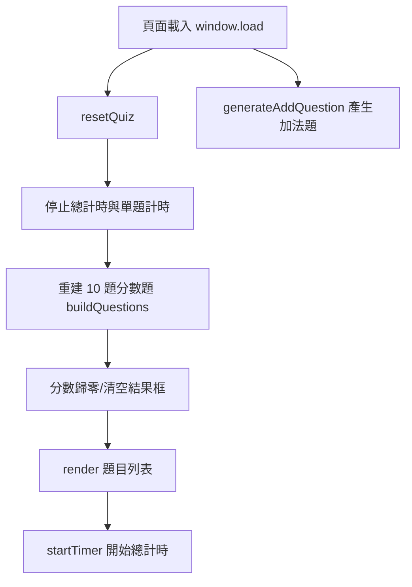
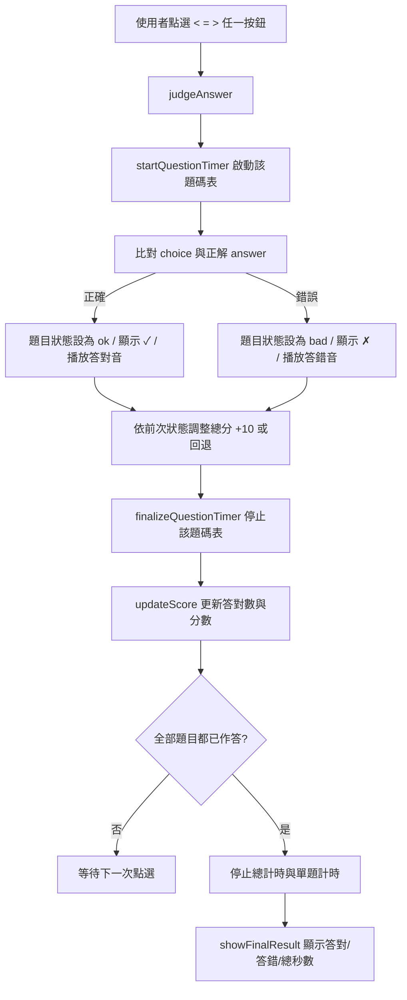
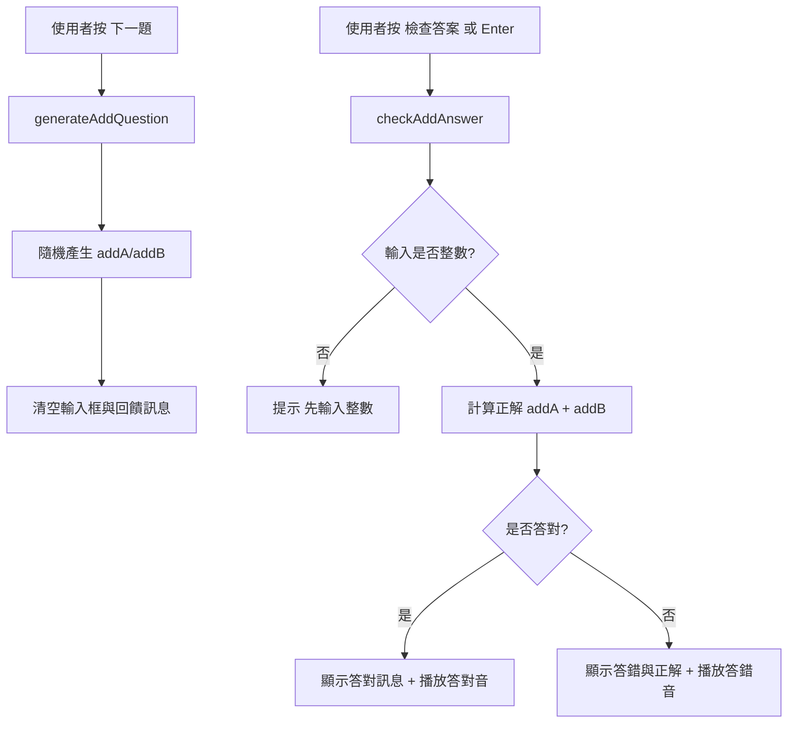
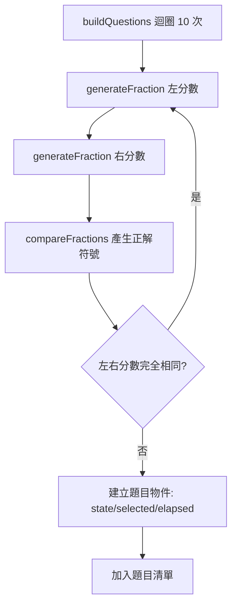

# 分數比大小練習專案：功能流程圖

以下流程圖以 `test.html` 的實際執行邏輯整理，分成「整體啟動流程」、「分數比較作答流程」與「加法練習流程」。

## 1) 整體啟動流程

```mermaid
flowchart TD
    A[頁面載入 window.load] --> B[resetQuiz]
    B --> B1[停止總計時與單題計時]
    B1 --> B2[重建 10 題分數題 buildQuestions]
    B2 --> B3[分數歸零/清空結果框]
    B3 --> B4[render 題目列表]
    B4 --> B5[startTimer 開始總計時]
    A --> C[generateAddQuestion 產生加法題]
```

## 2) 分數比較作答流程

```mermaid
flowchart TD
    Q1[使用者點選 < = > 任一按鈕] --> Q2[judgeAnswer]
    Q2 --> Q3[startQuestionTimer 啟動該題碼表]
    Q3 --> Q4[比對 choice 與正解 answer]

    Q4 -->|正確| Q5[題目狀態設為 ok / 顯示 ✓ / 播放答對音]
    Q4 -->|錯誤| Q6[題目狀態設為 bad / 顯示 ✗ / 播放答錯音]

    Q5 --> Q7[依前次狀態調整總分 +10 或回退]
    Q6 --> Q7
    Q7 --> Q8[finalizeQuestionTimer 停止該題碼表]
    Q8 --> Q9[updateScore 更新答對數與分數]
    Q9 --> Q10{全部題目都已作答?}
    Q10 -->|否| Q11[等待下一次點選]
    Q10 -->|是| Q12[停止總計時與單題計時]
    Q12 --> Q13[showFinalResult 顯示答對/答錯/總秒數]
```

## 3) 加法練習流程（1~10）

```mermaid
flowchart TD
    P1[generateAddQuestion] --> P2[隨機產生 addA/addB]
    P2 --> P3[清空輸入框與回饋訊息]

    U1[使用者按 檢查答案 或 Enter] --> U2[checkAddAnswer]
    U2 --> U3{輸入是否整數?}
    U3 -->|否| U4[提示 先輸入整數]
    U3 -->|是| U5[計算正解 addA + addB]
    U5 --> U6{是否答對?}
    U6 -->|是| U7[顯示答對訊息 + 播放答對音]
    U6 -->|否| U8[顯示答錯與正解 + 播放答錯音]

    N1[使用者按 下一題] --> P1
```

## 4) 題目生成邏輯（補充）

```mermaid
flowchart TD
    G1[buildQuestions 迴圈 10 次] --> G2[generateFraction 左分數]
    G2 --> G3[generateFraction 右分數]
    G3 --> G4[compareFractions 產生正解符號]
    G4 --> G5{左右分數完全相同?}
    G5 -->|是| G2
    G5 -->|否| G6[建立題目物件: state/selected/elapsed]
    G6 --> G7[加入題目清單]
```
